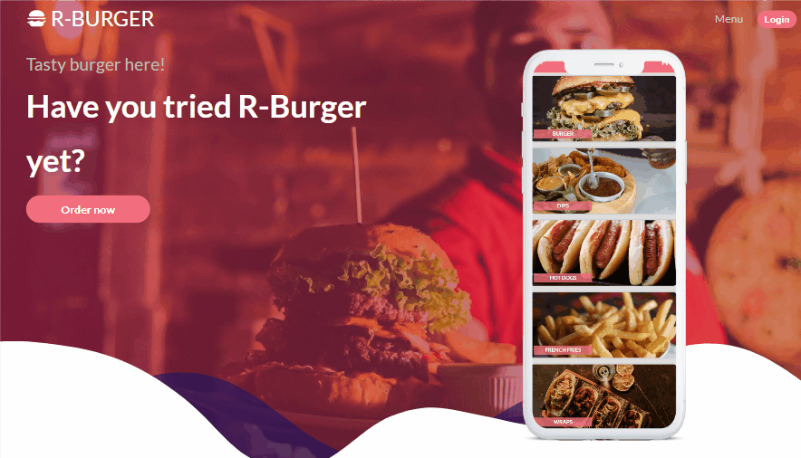
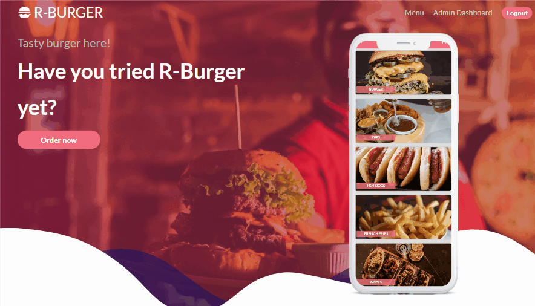
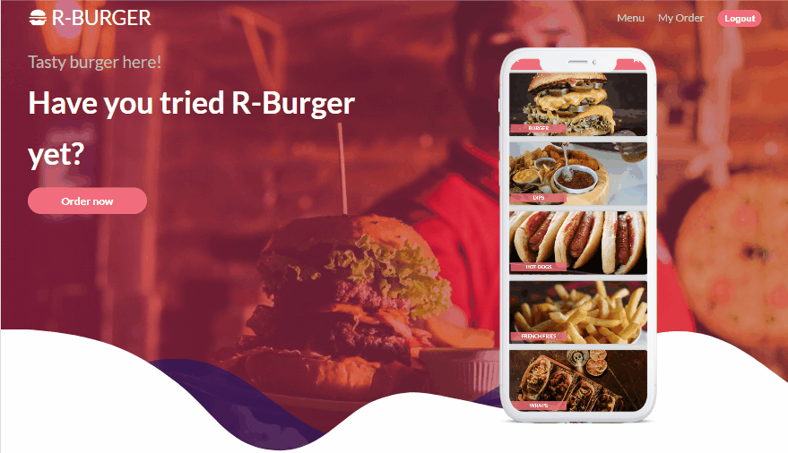

# R-Burger

[View Demo here](https://r-burger-restaurant-aagc.onrender.com)

Online fast food ordering application built with React JS for the frontend and Express JS and Mongoose for the backend. After logging in, the user can order the food he wants from the menu created by the admin by adding it to his cart. Additionally, there is an admin dashboard in the application that can only be accessed with the admin login. I created a [REST API](https://github.com/Tanju67/react-burger-backend) for the backend of this application.

1. Admin Credentials:

   - email:admin@mail.com
   - password:secret123

2. UserCredential:
   - email:test@mail.com
   - password:secret123


## Features

### Sign In & Sign Out

The user must log in to place an order. After logging in, the user can order the product he wants by adding it to the cart and then follow the status of his order on the my order page. To access the admin dashboard, you must log in with the admin's email and password.  


### Admin Dashboard

After logging in, the admin can add a new menu, update or delete the existing menu using the dashboard. Likewise, the admin can add a new product to the menu, update or delete the existing product. Finally, the admin can see the orders placed by customers and update the status of the orders.


### Order

After logging in, the user can order the product he wants from the menu by adding it to the cart. Afterwards, he can follow the status of his order on the my order page.


## Built With

- React JS
- Redux Tool Kit
- React Router
- CSS Modules

## Getting Started

### Prerequisites

Install npm.

- npm
  ```
  npm install npm@latest -g
  ```
- You must clone [the backend repo](https://github.com/Tanju67/react-burger-backend) of this application.
  ```
  git clone https://github.com/Tanju67/react-burger-backend.git
  ```

### Installation

1. Clone the repo.
   ```
   git clone https://github.com/Tanju67/react-burger-frontend.git
   ```
2. Install NPM packages.
   ```
   npm install
   ```
3. Create the backend url in a .env file.
   ```
   VITE_BACKEND_URL=your backend url
   ```
4. Start the frontend server (Firstly you must start backend server).
   ```
   npm run dev
   ```
